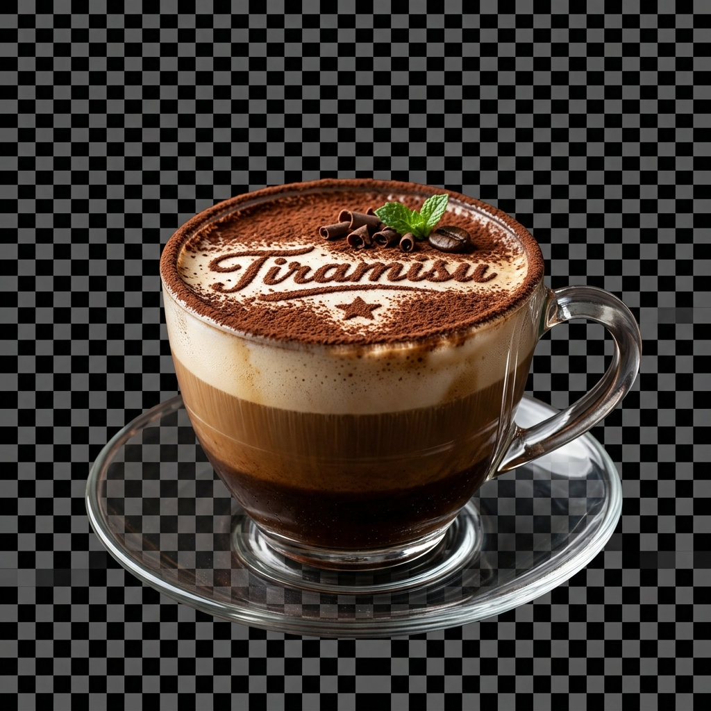
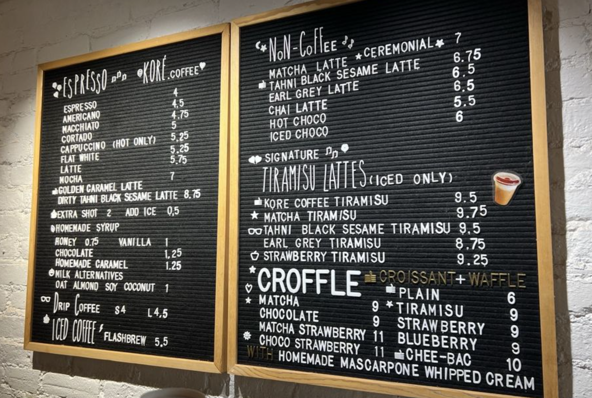

<div align="center">
  
  
  # Kore Coffee ☕
  
  **A premium, immersive web experience for Kore Coffee.**
  
  [](https://nextjs.org/)
  [](https://react.dev/)
  [](https://tailwindcss.com/)
  [](https://gsap.com/)

  [View Live Demo](https://kore-coffee-website.vercel.app/) · [Report Bug](https://github.com/neelpatel2501/Kore-Coffee-Website/issues) · [Request Feature](https://github.com/neelpatel2501/Kore-Coffee-Website/issues)
</div>

<br />

## 🌟 About The Project

**Kore Coffee** is a state-of-the-art landing page designed to provide a premium, visually stunning digital storefront for a modern coffee shop. Built with performance and aesthetics in mind, the website features a dark-themed, highly interactive UI that guides users through the coffee-making process, signature drinks, mouth-watering croffles, and a detailed menu.

Smooth scrolling, orchestrated animations, and a rich component architecture make this project a benchmark for modern web design.

### ✨ Key Features

- **Immersive Animations:** Powered by **GSAP** and **tw-animate-css** to bring elements to life as you scroll.
- **Fluid Smooth Scrolling:** Integrated **Lenis** for a buttery-smooth scrolling experience.
- **Premium Dark Aesthetic:** A cohesive, dark-themed UI (`bg-[#0A0A0A]`) that highlights the vibrant colors of the drinks and food.
- **Fully Responsive:** Beautifully crafted for mobile, tablet, and desktop viewports.
- **Modern Architecture:** Built on **Next.js 16.2** and **React 19** using the App Router for optimal performance.

---

## 🛠️ Tech Stack

This project leverages the latest tools in the React ecosystem:

* **Framework:** [Next.js 16.2](https://nextjs.org/)
* **Library:** [React 19](https://react.dev/)
* **Styling:** [Tailwind CSS 4](https://tailwindcss.com/)
* **Animations:** [GSAP](https://gsap.com/) & [Lenis](https://lenis.studiofreight.com/) (Smooth Scroll)
* **UI Components:** [Base UI](https://base-ui.com/), [Shadcn UI](https://ui.shadcn.com/)
* **Icons:** [Lucide React](https://lucide.dev/)
* **Package Manager:** [pnpm](https://pnpm.io/)

---

## 🚀 Getting Started

Follow these instructions to set up the project locally on your machine.

### Prerequisites

Ensure you have Node.js and pnpm installed:
- Node.js (v18+)
- pnpm (v9+)

### Installation

1. **Clone the repository**
   ```sh
   git clone https://github.com/neelpatel2501/Kore-Coffee-Website.git
   cd Kore-Coffee-Website
   ```

2. **Install dependencies**
   ```sh
   pnpm install
   ```

3. **Run the development server**
   ```sh
   pnpm dev
   ```

4. **Open the app**
   Navigate to [http://localhost:3000](http://localhost:3000) in your browser to see the result.

---

## 📂 Project Structure

```text
kore-coffee/
├── app/                  # Next.js App Router (pages, layout, globals.css)
├── components/           # Reusable UI components and page sections
│   ├── Hero.tsx
│   ├── AssemblySection.tsx
│   ├── SignatureDrinksSection.tsx
│   ├── SignatureCrofflesSection.tsx
│   ├── MenuSection.tsx
│   ├── GallerySection.tsx
│   └── VisitUsSection.tsx
├── lib/                  # Utility functions and configurations
├── public/               # Static assets (images, fonts, SVG logos)
├── package.json          # Project metadata and dependencies
└── tailwind.config.ts    # Tailwind CSS configuration
```

---

## 📸 Screenshots

| Signature Drink | Menu Section |
| :---: | :---: |
|  |  |

---

## 📄 License

Distributed under the MIT License. See `LICENSE` for more information.

---

<div align="center">
  <b>Built with ❤️ for Kore Coffee</b>
</div>
